# ER Diagram for Fintrip Database

## Entity Relationship Diagram

```mermaid
erDiagram
    %% Core Entities
    Office {
        bigint id PK
        bigint city_id FK
        varchar country
        varchar country_code
        varchar currency
        varchar name
        bigint office_head
        bigint hierarchy_id
        jsonb coords
        varchar gstin
        varchar registered_name
        varchar registered_address
        bigint programme_id
        bigint entity_id FK
        timestamp created_at
        timestamp updated_at
        bigint company_id
        jsonb tags
        jsonb attrs
    }

    Cities {
        bigint id PK
        varchar name
        varchar alternate
        double latitude
        double longitude
        bigint population
        bigint tier
        varchar image
        varchar thumbnail
        bigint district_id
        boolean is_district
        bigint country_id FK
        enum state
        boolean active
        timestamp created_at
        timestamp updated_at
    }

    Country {
        bigint id PK
        varchar name
        varchar code
        timestamp created_at
        timestamp updated_at
    }

    Entities {
        bigint id PK
        varchar name
        timestamp created_at
        timestamp updated_at
        bigint company_id
    }

    Department {
        bigint id PK
        varchar name
        bigint office_id FK
        bigint department_head
        boolean parent
        bigint programme_id
        timestamp created_at
        timestamp updated_at
        bigint company_id
        jsonb tags
        jsonb attrs
    }

    Grade {
        bigint id PK
        varchar name
        bigint department_id FK
        bigint team_head
        bigint programme_id
        timestamp created_at
        timestamp updated_at
        bigint company_id
        jsonb tags
    }

    Employee {
        bigint id PK
        varchar name
        varchar mobile
        varchar email
        varchar password
        jsonb profile
        bigint level_id FK
        bigint department_id FK
        uuid claim
        uuid token_secret
        varchar code
        bigint manager
        bigint alternate
        bigint hr_head
        bigint office_id FK
        bigint programme_id
        enum status
        enum type
        timestamp created_at
        timestamp updated_at
        bigint company_id
        bigint ledger_id
    }

    %% Service and Category Entities
    Category {
        bigint id PK
        bigint company_id
        varchar name
        boolean deleted
        timestamp created_at
        varchar color
    }

    Services {
        bigint id PK
        bigint company_id
        boolean deleted
        varchar name
        bigint category_id FK
        jsonb attrs
        timestamp created_at
        jsonb content
    }

    ProgrammeMappings {
        bigint id PK
        bigint programme_id
        bigint company_id
        bigint service_id FK
        boolean enabled
        varchar type
        timestamp created_at
    }

    ProgrammePolicy {
        bigint id PK
        bigint programme_id
        varchar policy_key
        enum policy_type
        int type
        varchar value
        timestamp created_at
        timestamp updated_at
        bigint company_id
    }

    %% Transaction Related Entities
    Transactions {
        bigint id PK
        varchar trans_id
        bigint super_category_id FK
        varchar tag
        enum owner_type
        bigint owner_id
        jsonb owner
        varchar plugin_id
        enum transaction_type
        enum payment_method_type
        bigint payment_method_id
        timestamp date
        timestamp end_date
        varchar service
        varchar currency
        double amount
        double reimbursable_amount
        bigint balance
        bigint voucher_id FK
        bigint expense_status
        bigint office_id FK
        bigint entity_id
        varchar office_name
        bigint department_id FK
        varchar department_name
        bigint reimbursement_id
        bigint project_id
        varchar project_name
        jsonb transaction_data
        bigint refund_id
        double refund_amount
        text ticket
        boolean refunded
        boolean clarification
        boolean fraud
        enum booking_status
        timestamp created_at
        timestamp updated_at
        bigint company_id
    }

    SuperCategory {
        bigint id PK
        varchar name
        timestamp created_at
        timestamp updated_at
        bigint company_id
    }

    TransactionOwners {
        bigint id PK
        enum owner_type
        bigint owner_id
        jsonb owner
        bigint transactions_id FK
        bigint status
        varchar service
        enum transaction_type
        timestamp date
        timestamp end_date
        double amount
        double expense
        enum acknowledgement
        jsonb attrs
        timestamp created_at
        timestamp updated_at
        bigint company_id
    }

    %% Voucher and Settlement Entities
    ExpenseVouchers {
        bigint id PK
        bigint trip_id
        bigint type
        varchar voucher_id
        bigint employee_id FK
        enum status
        varchar currency
        double initial_amount
        double total_amount
        timestamp approved_at
        timestamp finance_approved_at
        timestamp settled_at
        double claimed_amount
        double petty_amount
        bigint size
        bigint reimbursement_id
        bigint settlement_id
        bigint office_id FK
        jsonb initial_txns
        jsonb data
        jsonb current_txns
        jsonb logs
        jsonb forms
        bigint violation
        bigint alcohol_found
        bigint duplicate_transaction_found
        bigint fraud
        timestamp created_at
        timestamp updated_at
        bigint company_id
        jsonb attrs
    }

    ExpenseVoucherType {
        bigint id PK
        varchar title
        varchar color
        jsonb services
        timestamp created_at
        timestamp updated_at
        bigint company_id
        jsonb attrs
    }

    EmployeeSettlements {
        bigint id PK
        varchar ledger_id
        bigint office_id FK
        bigint vc_category_id
        bigint owner_id FK
        enum owner_type
        jsonb owner
        enum reference_type
        bigint reference_id
        bigint payout_id
        varchar currency
        double partial
        double partial_tds
        double amount
        double paid_amount
        double tds_amount
        boolean tds_settled
        double reverse_charge
        boolean reverse_settled
        boolean completed
        boolean settled
        bigint po_id
        timestamp created_at
        timestamp updated_at
        bigint company_id
        jsonb attrs
    }

    SettlementStatements {
        bigint id PK
        varchar statement_id
        bigint owner_id
        enum owner_type
        jsonb owner
        enum finance_type
        double balance
        varchar type
        varchar currency
        double tds_amount
        double paid_amount
        double amount
        bigint settlement_id FK
        timestamp created_at
        timestamp updated_at
        bigint company_id
        jsonb attrs
    }

    %% Permission Entities
    Permissions {
        bigint id PK
        bigint employee_id FK
        varchar permission_key
        enum permission_type
        enum permission_status
        timestamp granted_on
        jsonb violations
        jsonb form
        jsonb additional
        jsonb forms
        jsonb processor
        varchar reference_id
        jsonb data
        timestamp created_at
        timestamp updated_at
        bigint company_id
    }

    PermissionGranters {
        bigint id PK
        bigint permission_id FK
        varchar token
        enum permission_status
        boolean notify
        int rank
        timestamp notified_on
        jsonb config
        timestamp created_at
        timestamp updated_at
        bigint company_id
    }

    %% Additional Entities
    TransactionGraywolf {
        bigint id PK
        varchar file
        bigint transaction_id FK
        bigint employee_id FK
        jsonb response
        varchar service
        jsonb converted
        varchar trace_id
        varchar check_sum
        varchar gstin
        varchar merchant
        varchar date
        varchar invoice_id
        varchar amount
        timestamp created_at
        timestamp updated_at
        bigint company_id
    }

    %% Relationships
    Office ||--o{ Department : "has"
    Office }o--|| Cities : "located_in"
    Office }o--|| Entities : "belongs_to"
    Cities }o--|| Country : "belongs_to"
    
    Department ||--o{ Grade : "has"
    Department }o--|| Office : "belongs_to"
    
    Grade ||--o{ Employee : "has"
    Grade }o--|| Department : "belongs_to"
    
    Employee }o--|| Office : "works_at"
    Employee }o--|| Department : "belongs_to"
    Employee }o--|| Grade : "has_level"
    Employee ||--o{ Employee : "manages"
    
    Category ||--o{ Services : "contains"
    Services }o--|| Category : "belongs_to"
    
    Services ||--o{ ProgrammeMappings : "mapped_in"
    ProgrammeMappings }o--|| Services : "references"
    
    Transactions }o--|| SuperCategory : "categorized_as"
    Transactions }o--|| Office : "from_office"
    Transactions }o--|| Department : "from_department"
    Transactions ||--o{ TransactionOwners : "has_owners"
    Transactions ||--o{ TransactionGraywolf : "has_graywolf_data"
    
    TransactionOwners }o--|| Transactions : "owns"
    
    ExpenseVouchers }o--|| Employee : "belongs_to"
    ExpenseVouchers }o--|| Office : "from_office"
    ExpenseVouchers }o--|| Transactions : "contains"
    
    EmployeeSettlements }o--|| Employee : "for_employee"
    EmployeeSettlements }o--|| Office : "from_office"
    EmployeeSettlements ||--o{ SettlementStatements : "has_statements"
    
    SettlementStatements }o--|| EmployeeSettlements : "belongs_to"
    
    Permissions }o--|| Employee : "for_employee"
    Permissions ||--o{ PermissionGranters : "has_granters"
    
    PermissionGranters }o--|| Permissions : "grants"
    
    TransactionGraywolf }o--|| Transactions : "processes"
    TransactionGraywolf }o--|| Employee : "for_employee"
```

## Key Relationships Analysis

### 1. **Organizational Hierarchy**
- **Office** → **Department** → **Grade** → **Employee**
- Offices belong to Cities and Entities
- Employees can have managers (self-referencing relationship)

### 2. **Service Management**
- **Category** → **Services** (one-to-many)
- **Services** → **ProgrammeMappings** (many-to-many through junction table)
- **ProgrammePolicy** defines policies for programmes

### 3. **Transaction Processing**
- **Transactions** are the core entity for expense tracking
- **TransactionOwners** tracks who owns/benefits from transactions
- **TransactionGraywolf** stores additional processing data
- **ExpenseVouchers** group transactions for approval/settlement

### 4. **Settlement System**
- **EmployeeSettlements** handles financial settlements
- **SettlementStatements** provides detailed financial statements
- Connected to vouchers and reimbursements

### 5. **Permission System**
- **Permissions** define what employees can do
- **PermissionGranters** tracks who can grant permissions
- Multi-level approval workflow

### 6. **Multi-tenancy**
All entities implement multi-tenancy through `company_id` field, allowing data isolation between different companies.

### 7. **Audit Trail**
Most entities extend base models that include:
- `created_at` and `updated_at` timestamps
- Soft delete capabilities where applicable
- JSONB fields for flexible attributes and tags

## Database Design Patterns

1. **Inheritance**: Uses base classes like `MultiTenantBaseModel`, `MultiTenantTagsAttrsBaseModel`
2. **Soft Deletes**: Implemented in entities like `Category` and `Services`
3. **JSONB Storage**: Used for flexible data like coordinates, profiles, and attributes
4. **UUID Usage**: For security-sensitive fields like claims and tokens
5. **Enum Types**: For status fields, types, and categories
6. **Indexing**: Strategic indexes on frequently queried fields 